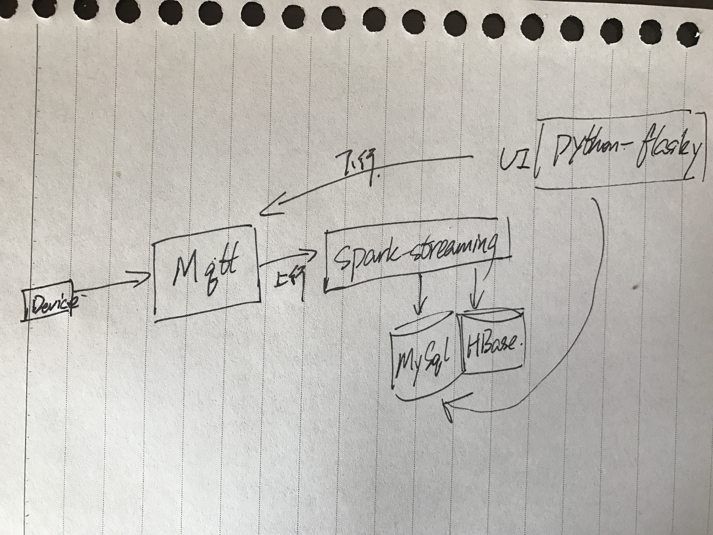

## IOT文档
### 需求
有多个房间，每个房间一个净化器，净化器定时上报数据给云端，包括空气质量数据及模式和开关状态，共三种数据，服务器通过mqtt下发控制指令给净化器，调节净化器开关状态及模式级别，下发指令有两条，再加一条心跳

### 上行消息格式

```
{"code":2170, "cmd":"status", "body":{}}
```

**格式说明**
|属性|说明|例子|
|----|----|----|
|code|校验码|2170|
|cmd|命令类型|status|
|body|消息体|{"temp":23.5, "humidity":32, "pm25":78, "mode":1}|

### 上行消息

```
# 状态消息
{"code":2170,"deviceno":"001", "cmd":"status", "body":{"temp":23.5, "humidity":32, "pm25":78, "mode":1}}

# 设备回复，有下发设置指令或者升级，硬件执行后，回复
{"code":2170,"deviceno":"001", "cmd":"device-resp", "body":{"cmd":"para-set", "result":0}}

# 硬件信息
{"code":2170,"deviceno":"001", "cmd":"hw-para", "body":{"hardver":"test", "softver":"test"}}
```

**消息说明**

|属性|说明|例子|
|----|----|----|
|deviceno|设备编号|001|
|temp|温度|23.5|
|humidity|湿度|32|
|pm25|pm2.5|78|
|model|模式|1：正常，2：紧急|

### 下行消息

```
# 下发设置
{"code":2170,"cmd":"para-set","body":{"mode":2}}

# 升级
{"code":2170,"cmd":"device-upgrade","body":{"url":"http://1.1.1.1/upgrade/xxx.bin","softver":"tysw1014","force":1}}
```

### 架构图


### 平台所用工具
Mqtt：相当于网关，硬件消息接入
Spark：数值计算
HBase：流数据存储
MySql：归档数据存储
Python：数据展现以及命令下发

### MySql数据库设计
**Device**

|字段名|类型|说明|
|----|----|----|
|id|int|主键|
|deviceno|varchar(20)|设备编号|
|type|INT|设备类型 1：空气净化器|
|imei|varchar(50)|imei号|
|ccid|varchar(50)||
|softver|varchar(50)|软件版本号|
|hardver|varchar(50)|硬件版本号|

**SendCommand(下行消息记录)**

|字段名|类型|说明|
|----|----|----|
|id|varchar(32)|主键 UUID|
|deviceno|varchar(20)|设备编号|
|type|int|消息类型 1:设置 2：升级|
|status|int|执行状态 1:下发中 2:成功 3：失败|
|content|varchar(5000)|消息内容|

### HBase数据设计
**Device**

|rowkey|列族|列名|
|----|----|----|
|deviceno|status|temp<br />humidity<br />pm25|